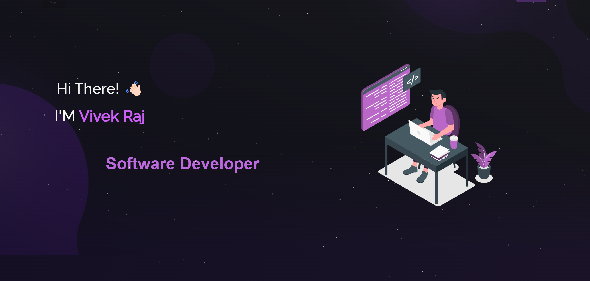

  

  
 

  
  
  
  

---

## 🌟 Hi There! I'm Vivek Raj 👋  
  
I'm a **Software Developer & AI Enthusiast** currently pursuing my **Master's in Computer Science (AI Track) at Binghamton University**. I have a deep passion for **Artificial Intelligence, Cybersecurity, and Software Engineering**, and I love solving **complex real-world problems** through **efficient and scalable solutions**.  

- 🔬 **Research Assistant (Prompt Engineering) at Binghamton University**  
- 🏆 **1st Place Winner – Best TechHack (HACKBU 2024)**  
- 💻 **Software Intern at Central Hudson Gas & Electric Corp**  
- 🎯 **Teaching Assistant (Computer Security & Algorithms), mentoring 100+ students**  
- 🚀 **MITRE eCTF 2025 Competitor (Embedded Security)**  
- 📚 Always exploring **Machine Learning, Embedded Systems, and Algorithm Optimization**  

---

### 📫 Let's Connect!  

  
  
  
  

---

## 🚀 Technical Skills  

### Programming Languages  

  

### Web Development  

  

### Backend Development  

  

### Machine Learning & AI  

  

---

## 🔬 Research & Projects  

🚀 **MITRE eCTF 2025 (Embedded Security Competition)**  
- Developed **AES-128-CFB encryption** with Boolean masking on the **MAX78000FTHR** board  
- Implemented **anti-replay defenses & cryptographic timestamp verification**  
- Built a **real-time embedded decoder (10+ FPS)** with side-channel protections  
🔗 [GitHub Repository](https://github.com/rajv79/MITRE-eCTF-2025)

📌 **Custom Memory Management System (C)**  
- Optimized **kernel-space performance** by **30%**  
- Implemented **bitmap-based tracking & function interposition** for efficiency  
🔗 [GitHub Repository](https://github.com/rajv79/CustomMemoryManagement)

📊 **ConcurrentTextAnalyzer (Map-Reduce for Text Processing)**  
- Designed **scalable map-reduce framework in C**, reducing processing time **by 20%**  
- **Multithreaded text segmentation & synchronization**, boosting efficiency **by 40%**  
🔗 [GitHub Repository](https://github.com/rajv79/ConcurrentTextAnalyzer-Map-Reduce-for-Text-Processing-)

---

## 🏆 Achievements & Certifications  

- 🥇 **1st Place Winner – Best TechHack (HACKBU 2024)** | [Project Link](https://devpost.com/software/air-mouse)  
- 🏆 **Runner-up – QubitX Hacks (April 2024)** | [Project Link](https://devpost.com/software/air-mouse)  
- 💻 **Software Engineering Virtual Experience – JPMorgan Chase & Co. (2023)**  
- 🔐 **Cybersecurity Virtual Experience – JPMorgan Chase & Co. (2023)**  

---

## 📊 GitHub Stats  

  

  

  

---

## 🏆 GitHub Trophies  

  

---

## 📚 Relevant Courses  

- **Machine Learning & AI**  
- **System Programming & Operating Systems**  
- **Advanced Computer Architecture**  
- **Computer Security & Cryptography**  
- **Design & Analysis of Algorithms**  
- **Human-Computer Interaction**  

---

## ✨ Quotes & Inspiration  

💡 **"In the realm of technology, every challenge is an opportunity to innovate and make a difference."**  

🔥 **"The moment you think of giving up, think of the reason why you held on so long."**  

🚀 **"If you don’t take risks, you can’t create a future."**

---
